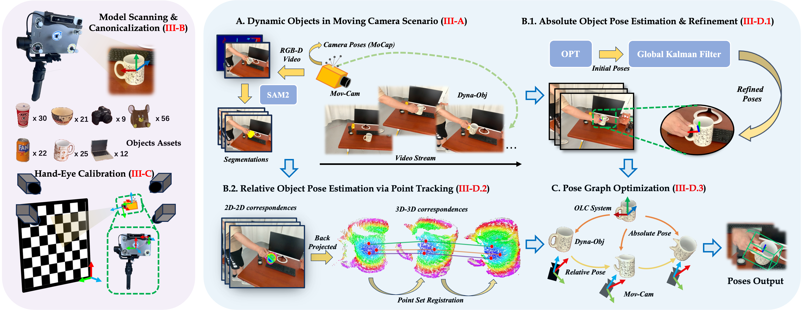

<h1 align="center">Dyn<span style="color: green;">OPETs</span>: A Versatile Benchmark for Dynamic <span style="color: green;">O</span>bject <span style="color: green;">P</span>ose <span style="color: green;">E</span>stimation and <span style="color: green;">T</span>racking in Moving Camera <span style="color: green;">S</span>enarios</h1>

<p align="center" style="font-size: larger; color: #d73027; font-weight: bold;">
🎉 Accepted at RA-L 2025! 🎉
</p>

<p align="center" style="font-size: larger;">
Xiangting Meng* · Jiaqi Yang* · Mingshu Chen · Chenxin Yan · Yujiao Shi · Wenchao Ding · Laurent Kneip
</p>
<p align="center" style="font-size: larger;">
* Equal Contribution
</p>

<p align="center" style="font-size: larger;">
  <a href="https://stay332.github.io/DynOPETs"><strong>Project Page</strong></a> |
  <a href="https://www.youtube.com/watch?v=hCOwqutWoLI"><strong>Video</strong></a> |
  <a href="https://arxiv.org/pdf/2503.19625"><strong>Paper</strong></a> | 
  <a href="https://stay332.github.io/DynOPETs/assets/pdf/supp.pdf"><strong>Supplementary</strong></a>
</p>

<p align="center">
  
</p>

---

## 📢 Updates

- **[July 22, 2025]** 🎉🎉 DynOPETs is now accepted on RA-L 2025.
- **[June 23, 2025]** 🎉 DynOPETs is now open source! We also provide visualization tools for rendering object models to facilitate learning and usage.

---

## 📊 DynOPETs Datasets Overview

<p align="center">
  
</p>

**DynOPETs** is a real-world RGB-D dataset designed for object pose estimation and tracking in dynamic scenes with moving cameras. The dataset is split into two complementary subsets:

### 🏷️ COPE119
- **119 sequences** covering **6 common categories** from the COPE benchmark
- **Categories**: bottles, bowls, cameras, cans, laptops, mugs
- **Purpose**: Designed for COPE (Category-level Pose Estimation) methods
- **Size**: 41.42GB
- **[Download Link](https://drive.google.com/drive/folders/1v2gDBpawSnMnq5O3b12ePfEp1MyJ4TwK?usp=drive_link)**

### 🔍 UOPE56
- **56 sequences** of unconstrained household objects
- **Purpose**: Tailored for UOPE (Unseen Object Pose Estimation) methods
- **Size**: 18.24GB
- **[Download Link](https://drive.google.com/drive/folders/1wYSwy-MKwDPFuEDXHD0GnnfS7Bg6Ft85?usp=drive_link)**

---
## Annotation Pipeline

<p align="center">
  
</p>

---

## 📦 Setup
```
conda create -n dynopets python=3.10
conda activate dynopets
pip install -r requirements.txt
```
## 📦 Modules

### 📊 Global Kalman Filter

```
python src/abs_pose_global_kf.py --seqs_id bottle_00 --vis_on_subplots 
```

The Global Kalman Filter module performs pose smoothing on initial absolute poses. The initial absolute poses can be obtained from methods like **FoundationPose** / **BundleSDF**.

**Key Features:**
- Forward Part: **Extended Kalman Filter (EKF)** for rotation and translation smoothing
- Backward Part: **Rauch-Tung-Striebel (RTS)** backward smoothing for optimal state estimation
- **TUM format** input/output for pose trajectories

**Input Data Format:**
- `poses`: TUM format pose file with timestamps and 4x4 transformation matrices
- `fps`: Frame rate for temporal dynamics modeling (default: 15 Hz)

**Output:**
- Smoothed pose trajectories in TUM format
- Euler angle comparison plots (raw, forward optimized, backward optimized)
- State covariance matrices for uncertainty quantification

### 📊 Relative Pose Post-Processing

```
python src/relative_pose_post_processing.py  
```
The Relative Pose Post-Processing module refines camera poses using visual tracking and depth information.

**Key Features:**
- **RANSAC-based Pose Estimation** with Arun's method for robust 3D-3D point alignment
- **Covariance Estimation** using numerical Jacobian for pose uncertainty quantification

**Input Data Format:**
- `tracks`: Visual feature tracks with shape `[frame, num_points, xy_coordinates]` (**Cotracker** / **VGGSfM** scaled coordinates)
- `depth_images`: Depth image sequence with shape `[frame, H, W]` stored as `.npy` file
- `intrinsics`: Camera intrinsic matrix with shape `[fx, fy, cx, cy]`

**Output:**
- `relative_poses`: List of 4x4 relative transformation matrices between consecutive frames
- `relative_covariances`: List of 6x6 covariance matrices for uncertainty quantification
- Optimized object poses for downstream Pose Graph Optimization


### 📊 Pose Graph Optimization

```
python src/pose_graph_optimization.py
```
The Pose Graph Optimization module performs global optimization of object poses using relative pose constraints and absolute pose priors.

**Key Features:**
- **GTSAM**-based pose graph optimization.
- Combines **Absolute Pose Priors** with **Relative Pose constraints**.
- Support for marking **Unreliable Frames** with adjustable prior weights.
- **Levenberg-Marquardt** optimization with decoupled translation/rotation covariances.
- Flexible prior weight configuration (e.g., **1e-5** for first frame, **1e-3** for others).

**Input Data Format:**
- `relative_poses`: Relative poses between consecutive frames (from **Relative Pose Post-Processing**)
- `covariances`: 6x6 covariance matrices for pose uncertainty estimation (from **Relative Pose Post-Processing**)
- `absolute_poses`: Absolute pose estimates (from **Global Kalman Filter**)
- `prior_weights`: Weights for absolute pose constraints (e.g., 1e-5 for first frame, 1e-3 for others)

**Output:**
- Optimized 4x4 pose matrices for all frames


## 🛠️ DynOPETs Toolbox


### Object Pose Visualization Tool
```
python visulization_tools/runner_rendering.py --show_axis --save_mode video --names "bottle_00, bottle_01"

# Parameters:
 --names, -ns: Comma-separated list of object names to render (default: "bottle_00, bottle_01")
 --output_dir, -od: Output directory for rendered results (default: "results")
 --device, -d: Device to use for rendering (default: "cuda")
 --show_axis: Show coordinate axis on rendered images (flag)
 --save_mode, -sm: Output format - "video" or "images" (default: "video")
 
```
<!-- ### Visualization Results

<p align="center">
  <table>
    <tr>
      <td align="center">
        
        <br><em>Bottle</em>
      </td>
      <td align="center">
        
        <br><em>Bowl</em>
      </td>
      <td align="center">
        
        <br><em>Camera</em>
      </td>
    </tr>
    <tr>
      <td align="center">
        
        <br><em>Can</em>
      </td>
      <td align="center">
        
        <br><em>Laptop</em>
      </td>
      <td align="center">
        
        <br><em>Mug</em>
      </td>
    </tr>
    <tr>
      <td align="center">
        
        <br><em>Others</em>
      </td>
      <td align="center">
        
        <br><em>Others</em>
      </td>
      <td align="center">
        
        <br><em>Others</em>
      </td>
    </tr>  </table>
</p> -->

### Point Cloud Generation Tool

```
python cloud_generater.py --subset COPE119 --seqs bottle_00
```


## Dataset Format

```
DynOPETs
    ├── COPE119
    │     ├── bottle (30 sequences)
    │     ├── bowl (21 sequences)
    │     ├── camera (9 sequences)
    │     ├── can (22 sequences)
    │     ├── laptop (10 sequences)
    │     └── mug (25 sequences)
    │     └── groundtruth
    └── UOPE56
          └── others (56 sequences)
          └── groundtruth

bottle (example)
  ├── bottle_00
  │     ├── cam_annotations 
  │     │         ├── gripper2base.npy
  │     │         └── gripper_tstamps.npy
  │     ├── color (0000_color.png ...)
  │     ├── depth (0000_depth.png ...)
  │     ├── mask  (0000_mask.png ...)
  │     └── model 
  │           ├── Model.jpg
  │           ├── Model.mtl
  │           └── Model.obj
 ...
```
### COPE119 [Trainset](COPE119/COPE119_trainset_list.txt), [Testset](COPE119/COPE119_testset_list.txt) 


## Devices & Softwares

- RGB-D Camera: [Structure Sensor](https://structure.io/) with iPad Pro

  We developed a **Real-time Visualization & Record App** based on the official SDK that displays and records **RGB, Depth, and Normal images** when connected, making it convenient for everyone to develop and use.

  
  For detailed usage instructions of this software, please refer to the tutorial in the repository below:

  [**Structure Sensor Record App**](https://github.com/Launch-on-Titania/Structure-Sensor-Record)

  <p align="center">
    
  </p>

- Motion Capture System (for camera pose only): [OptiTrack](https://optitrack.com/) Motive

- Object Model Scanner: [Scanner-Structure SDK](https://apps.apple.com/us/app/scanner-structure-sdk/id891169722?platform=ipad) with iPad Pro
  
  We used the **Scanner-Structure SDK** that comes with Structure Sensors to achieve precise **3D Object Asset Scanning**.


## Contact
If you have any questions, please feel free to contact us:

[Xiangting Meng](https://github.com/Launch-on-Titania): [mengxt@shanghaitech.edu.cn](mailto:mengxt@shanghaitech.edu.cn), [arnoxtmann@gmail.com](mailto:arnoxtmann@gmail.com)

[Jiaqi Yang](https://github.com/Jiaqi-Yang): [yangjq12022@shanghaitech.edu.cn](mailto:yangjq12022@shanghaitech.edu.cn)

## Citation
```bibtex
@article{meng2025dynopets,
  title={DynOPETs: A Versatile Benchmark for Dynamic Object Pose Estimation and Tracking in Moving Camera Scenarios},
  author={Meng, Xiangting and Yang, Jiaqi and Chen, Mingshu and Yan, Chenxin and Shi, Yujiao and Ding, Wenchao and Kneip, Laurent},
  journal={arXiv preprint arXiv:2503.19625},
  year={2025}
}
```

## Acknowledgments
We would like to thank the following works:
[FoundationPose](https://github.com/NVlabs/FoundationPose), [BundleSDF](https://github.com/NVlabs/BundleSDF), [CoTracker](https://github.com/facebookresearch/co-tracker), [VGGSfM](https://github.com/facebookresearch/vggsfm)


## License
This project is released under the [CC BY-NC-SA 4.0](https://creativecommons.org/licenses/by-nc-sa/4.0/) license. See [LICENSE](LICENSE) for additional details.
